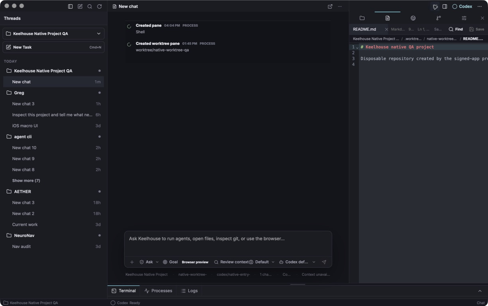
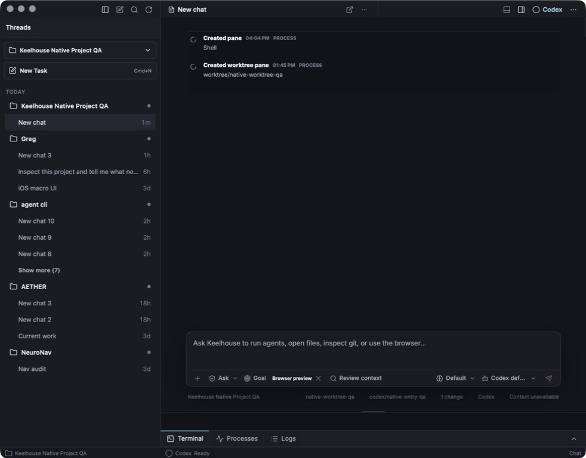
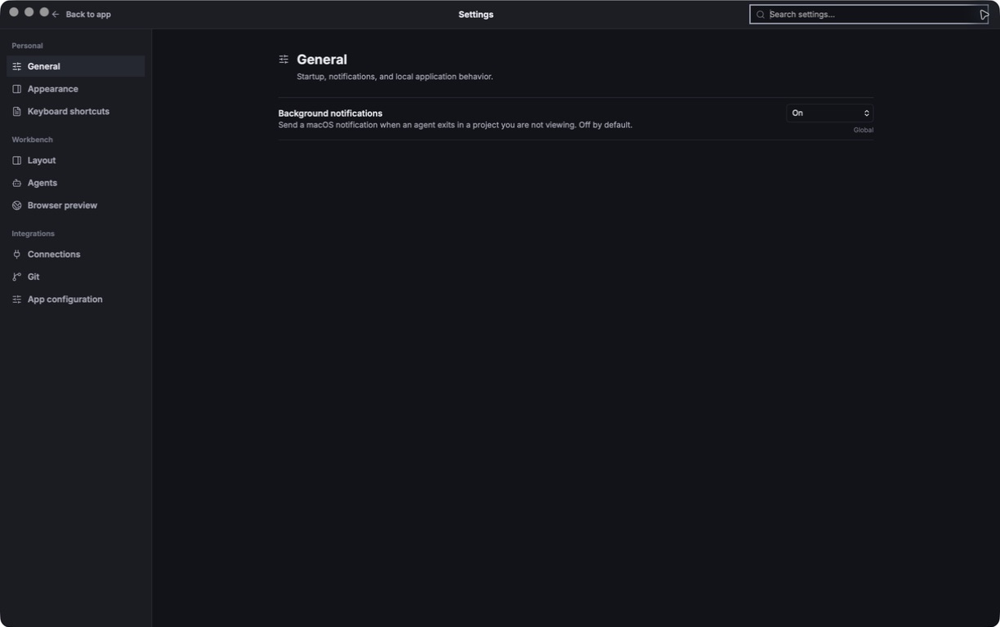

# Keelhouse

**A native macOS workbench for running coding agents without the weight of a full IDE.**

Keelhouse keeps structured agent conversations at the center of the screen, then brings projects, files, editing, Git, browser preview, and real terminal sessions into resizable trays around them. It is built for developers who use tools such as Codex, Claude, Gemini, or OpenCode while relying on VS Code mainly as a project shell.

> **Alpha:** Keelhouse is under active development. The source and local packaging path are public, but there is not yet a notarized public download.



## Why Keelhouse

Agent-driven development changes the center of gravity of an IDE. The primary loop becomes:

1. Open or switch a project.
2. Give a coding agent a goal and the right context.
3. Review activity, files, diffs, and local output.
4. Keep independent projects and conversations recoverable.

Keelhouse is the native structure around that loop. It preserves the useful parts of a workbench while leaving out the extension marketplace, debugger sprawl, account chrome, and general-purpose chat features.

## What Works Today

- Project creation, folder opening, recent-project switching, and first-use recovery.
- Multiple persisted chats per project with independent provider and run state.
- Structured Codex conversations with Markdown, tool activity, stop/error handling, and permission decisions.
- Real PTY-backed terminal panes for installed coding-agent CLIs and shells.
- Project-scoped file explorer, CodeMirror editor, tabs, find/replace, dirty-state protection, and safe saving.
- Git-aware review surfaces, worktree targets, browser preview, and detected local development servers.
- Provider/model settings, local CLI health, macOS Keychain-backed secrets, and custom terminal profiles.
- Responsive desktop chrome with movable tool trays and a compact layout at the native minimum width.
- SQLite chat persistence, Tauri Store workspace preferences, crash recovery, and session restoration.

Codex is the most thoroughly exercised structured provider path. Claude and OpenCode integration are still being hardened, while Gemini and arbitrary installed CLIs remain available through real terminal panes.

## Product Views

| Responsive workbench | Scoped settings |
|---|---|
|  |  |

The screenshots above were captured from the packaged native macOS app, not the HTML demos.

## Architecture

Keelhouse separates structured agent events from terminal rendering instead of scraping terminal text into chat messages.

```text
Structured agent path
composer -> Tauri command -> provider JSON events -> typed reducer -> SQLite chat timeline

Raw terminal path
CLI process <-> portable-pty -> libghostty-vt -> Tauri IPC -> Canvas terminal
```

| Layer | Technology | Responsibility |
|---|---|---|
| Native shell | Tauri 2 | Windowing, commands, events, packaging |
| Backend | Rust | Provider processes, PTYs, terminal state, persistence, file operations |
| Terminal | `portable-pty` + `libghostty-vt` | Real process sessions and VT/xterm parsing |
| Frontend | React 19 + TypeScript + Vite | Workbench chrome, chat, trays, settings |
| Editor | CodeMirror 6 | Source editing, search, tabs, view-state restoration |
| Persistence | SQLite WAL + Tauri Store | Durable chats plus lightweight workspace preferences |

See [ARCHITECTURE.md](ARCHITECTURE.md) for the process and ownership boundaries, and [DECISIONS.md](DECISIONS.md) for the append-only decision trail.

## Run From Source

### Prerequisites

- macOS on Apple silicon for the currently verified packaging path.
- Node.js and npm.
- Rust and Cargo.
- Zig `0.15.2` for the Ghostty bridge. Zig `0.16` is not compatible with the pinned terminal dependency.
- Any provider CLIs you want to run, already authenticated through their normal local login flow.

```bash
git clone https://github.com/jpoindexter/keelhouse.git
cd keelhouse/app
npm install
PATH="/opt/homebrew/opt/zig@0.15/bin:$PATH" npm run tauri dev
```

Keelhouse uses your installed provider tools. Credentials remain with those CLIs or in the macOS Keychain; do not commit API keys to this repository.

## Build the macOS App

```bash
cd app
npm run package:mac
open src-tauri/target/release/bundle/macos/Keelhouse.app
```

The local package is arm64 and ad-hoc signed. Developer ID signing and Apple notarization are separate release gates, so macOS distribution is not represented as production-ready yet. See [docs/packaging.md](docs/packaging.md).

## Verification

The normal pre-push gate is:

```bash
cd app
npm run build
npm run qa:repo-hygiene
npm run qa:module-size
npm run qa:chrome-contract
npm test -- --run
git diff --check

cd src-tauri
PATH="/opt/homebrew/opt/zig@0.15/bin:$PATH" cargo test
```

The repository also keeps native screenshots, interaction records, packaged-app checks, provider approval evidence, and performance captures under [`docs/qa/`](docs/qa/).

Source files follow a ratcheted **300/200/50** modularity contract: at most 300 lines per source file, 200 per React component file, and 50 per function, component, or hook. Existing debt cannot grow, and new files receive no exception.

## Repository Map

| Path | Purpose |
|---|---|
| [`app/`](app/) | Tauri, React, TypeScript, and native application code |
| [`app/src-tauri/`](app/src-tauri/) | Rust processes, PTYs, persistence, provider adapters, and filesystem commands |
| [`docs/`](docs/) | Architecture notes, product research, packaging, and QA evidence |
| [`demo/`](demo/) | Visual prototypes used to test shell direction before implementation |
| [`PRD.md`](PRD.md) | Product scope, daily workflow, and non-goals |
| [`ROADMAP.md`](ROADMAP.md) | Human-readable execution roadmap |
| [`STATE.md`](STATE.md) | Current handoff and verified next step |

## Project Status

The terminal and workbench architecture is proven in the native app. Current work is focused on completing the 300/200/50 modularity migration, hardening provider/model selection, and preparing the first honest downloadable release.

- [Product requirements](PRD.md)
- [Roadmap](ROADMAP.md)
- [Current state](STATE.md)
- [Packaging status](docs/packaging.md)
- [GitHub releases](https://github.com/jpoindexter/keelhouse/releases)

## Scope

Keelhouse is intentionally not a VS Code clone, generic terminal emulator, plugin marketplace, hosted automation platform, or consumer chat app. Its scope is the local agent-workbench loop: projects, conversations, files, review, terminals, and preview.

## License and Contributions

Issues and technical feedback are welcome while the product is in alpha. This repository does not yet include an open-source license, so the published source is available for review but should not be assumed to grant redistribution or modification rights.

Keelhouse builds on open-source work including [Tauri](https://tauri.app/), [Ghostty](https://ghostty.org/), [CodeMirror](https://codemirror.net/), React, and Rust. Their respective licenses remain with their projects.

Built by [Jason Poindexter](https://github.com/jpoindexter).
