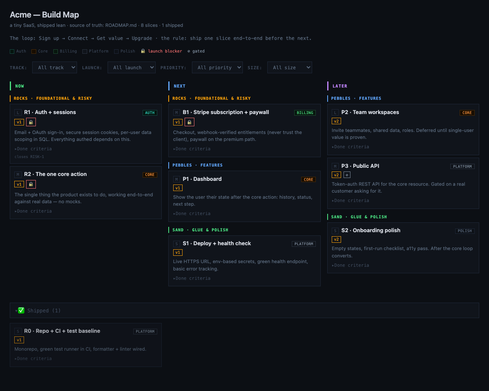

# rockmap

Turn one JSON file into a **single, self-contained, interactive roadmap board** — no build step, no framework, no dependencies. Open the output `.html` anywhere, or commit it to GitHub Pages and share a link.

A roadmap as **Now / Next / Later** columns × **Rocks / Pebbles / Sand** priority bands, with filters for track, launch, size, and more. Everything — columns, bands, colors, filters — is driven by your JSON.



## Why

Most roadmap tools are SaaS with a login. This is one Node script and one JSON file. The output is a single HTML file you fully own — email it, drop it in a repo, host it on Pages. It reads like a kanban but encodes priority (rocks before sand), risk (🔒 launch blockers), and release (v1/v2) so a roadmap actually says *what to build next*, not just *what exists*.

The model:
- **Now / Next / Later** — when, not hard dates.
- **Rocks / Pebbles / Sand** — rocks are load-bearing and risky, pebbles are features, sand is glue and polish. Do rocks first.
- **Tracks** — your workstreams (Auth, Billing, UI…), each a colored lens + a filter.

## Quick start

Requires Node 18+. No install needed.

```bash
git clone https://github.com/jpoindexter/rockmap.git
cd rockmap

# build the included template -> roadmap.html
node build-roadmap.mjs

# or point it at your own file
node build-roadmap.mjs my-roadmap.json my-roadmap.html

# see a fuller example
node build-roadmap.mjs examples/saas.json examples/saas.html
```

Open the generated `.html` in any browser. That's the whole tool.

Optionally use it as a CLI:

```bash
npm link        # then, anywhere:
rockmap roadmap.json roadmap.html
```

## Authoring

Edit `roadmap.json` (or copy it). Point your editor at `roadmap.schema.json` for autocomplete and validation — the included files already have `"$schema"` set.

A card:

```json
{
  "id": "R1",
  "title": "Auth + sessions",
  "column": "now",
  "tier": "rock",
  "track": "auth",
  "size": "L",
  "launch": "v1",
  "blocker": true,
  "summary": "Email + OAuth sign-in, secure sessions, per-user data scoping.",
  "done": "A user signs up, signs out, signs back in; no route leaks another user's data.",
  "closes": "closes RISK-1"
}
```

| Field | Required | Notes |
|---|---|---|
| `id` | yes | Short stable id, shown before the title. |
| `title` | yes | |
| `column` | yes (cards) | Must match a `columns[].id`. |
| `tier` | no | Must match a `tiers[].id`. Groups the card within its column. |
| `track` | no | Must match a `tracks[].id`. Renders a colored chip + filter. |
| `size` | no | `S` / `M` / `L`. |
| `launch` | no | Release bucket id (e.g. `v1`), drives the launch filter. |
| `model` | no | Optional executor/model badge (see `models`). |
| `effort` | no | Free text shown beside the model badge. |
| `blocker` | no | `true` → 🔒 launch blocker. |
| `gated` | no | `true` → ⊘ externally gated. |
| `summary` | no | 1–2 dense sentences. |
| `done` | no | Definition of done (collapsible). |
| `closes` | no | Footer line (e.g. risks/gaps closed). |

Top-level keys: `title`, `subtitle`, `loop`, `columns` (required), `tiers`, `tracks`, `launches`, `models`, `cards` (required), `shipped`. Anything optional that you omit simply doesn't render — drop `tiers` and cards aren't banded; drop `models` and the model filter disappears. Full reference: [`roadmap.schema.json`](roadmap.schema.json).

Move a card to the `shipped` array (and add a `shipped` date) when it lands — it drops into a dimmed, collapsible "Shipped" section.

## Output

One HTML file with inline CSS and a tiny vanilla-JS filter — no network requests, no tracking, works offline. All user text is HTML-escaped. Host it free on GitHub Pages:

```bash
node build-roadmap.mjs roadmap.json docs/index.html
git add docs/index.html && git commit -m "docs: publish roadmap" && git push
# then enable Pages → Deploy from branch → /docs
```

## Design notes

- **Zero dependencies on purpose.** No `npm install`. The whole point is that you can read every line and trust the output. Validation is hand-rolled with actionable errors rather than pulling a schema library at runtime (the JSON Schema is for your editor).
- **Source is the JSON, not the HTML.** `.gitignore` ignores generated `*.html`; commit the JSON and regenerate. (Except when publishing to Pages — then commit `docs/index.html`.)

## License

MIT © Jason Poindexter
